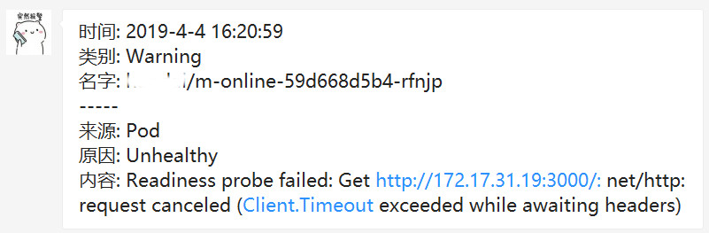
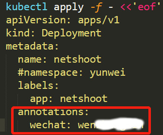
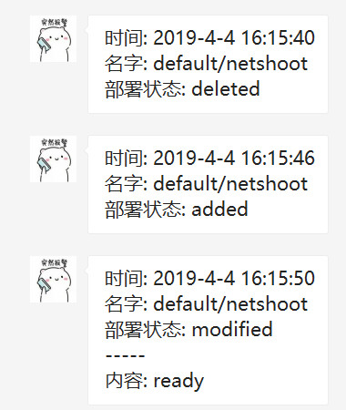

# k8s-watcher

## Features

- Notify on k8s (non-normal) events
- Deploy add/delete success notify
- working with https://github.com/chinglinwen/wechat-notify


## Demo

### example events message



### example deploy notfy setting



### example deploy notify message



## Usage

```
$ ./k8s-watcher -h
Usage of ./k8s-watcher:
  -a string
    	deploy annotation name (default "wechat")
  -e string
    	default expire time duration (default "10m")
  -kubeconfig string
    	(optional) absolute path to the kubeconfig file (default "$HOME/.kube/config")
  -party string
    	default receiver party ( eg. 3 )
  -r string
    	default wechat receiver
  -w string
    	wechat notify service url (default "http://localhost:8001")
```